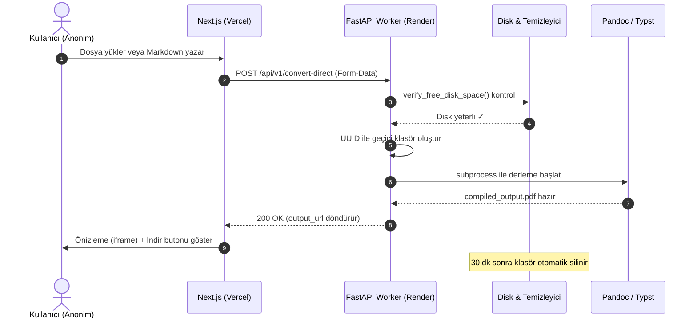

# 🏛️ Sistem Mimarisi ve Teknik Tasarım Dokümanı

Bu doküman, **RunDoc** platformunun Next.js (Frontend) ve Python FastAPI (Worker) mimarisini, gizlilik odaklı tasarım kararlarını, API yapısını ve veri akış şemalarını tanımlar.

---

## 1. Genel Sistem Mimari Yapısı

RunDoc, **iLovePDF/Smallpdf** modeline dayanan anonim, ücretsiz ve gizlilik odaklı bir doküman dönüştürme platformudur. Kullanıcı hesabı, giriş/çıkış veya bulut depolama gerektirmez.

**Dağıtım Altyapısı:** Vercel (Frontend) + Render (Docker Backend)

```text
                                  +---------------------------------------------+
                                  |            Next.js Web (Vercel)              |
                                  |  - Tek Sayfa Dönüştürücü Arayüzü            |
                                  |  - Monaco Editör + Drag & Drop Upload       |
                                  |  - Anlık Önizleme (PDF/HTML iframe)         |
                                  +----------------------+----------------------+
                                                         |
                                                         | HTTP API POST / GET
                                                         v
                                  +---------------------------------------------+
                                  |         Python FastAPI Worker (Render)       |
                                  |  - Anonim Erişim (Auth Yok)                 |
                                  |  - Subprocess Tabanlı Pandoc Derleyici      |
                                  |  - Otomatik Geçici Dosya Temizleyici        |
                                  |  - Rate Limiting & Disk Koruyucu            |
                                  +----------------------+----------------------+
                                                         |
                         +-------------------------------+-------------------------------+
                         |                                                               |
                                       [ EPHEMERAl MODEL ]
                         +---------------------------------------------+
                         |           Gizlilik Odaklı Geçici Çözüm       |
                         |  - Bellek İçi Sözlük Veri Kaydı (MOCK_LOGS)  |
                         |  - Lokal Disk Çıktı Sunucusu (/outputs/*)    |
                         |  - 30 dk Sonra Otomatik Temizlik              |
                         |  - Kullanıcı Verisi Saklanmaz                 |
```

---

## 2. Gizlilik Odaklı Ephemeral Model (Privacy-First Ephemeral Mode)

Platform, kullanıcı gizliliğini en üst düzeyde korumak ve sıfır bulut maliyetiyle çalışmak amacıyla tasarlanmıştır:

1. **Sıfır Kimlik Doğrulama:**
   Hiçbir kullanıcı hesabı, giriş veya token mekanizması yoktur. Herkes doğrudan dönüştürme motoruna erişebilir.

2. **Geçici Dosya Yaşam Döngüsü:**
   - Kullanıcı dosya gönderdiğinde, sunucuda benzersiz UUID klasörü oluşturulur: `temp_workdir/{uuid}`
   - Girdi dosyası yazılır, saniyeler içinde derlenir, çıktı aynı klasöre kaydedilir
   - Kullanıcı dosyasını indirir veya önizler
   - **30 dakika** sonra arka plan temizleyici tüm eski klasörleri otomatik siler

3. **Otomatik Çöp Temizleyici (Background Cleaner):**
   FastAPI startup event'inde başlatılan asyncio görevi, her 10 dakikada bir `temp_workdir` dizinini tarar. `st_mtime` değeri 30 dakikayı geçen tüm alt klasörleri `shutil.rmtree()` ile tamamen siler. Böylece disk dolmaz ve kullanıcı verileri kalıcı olarak barınmaz.

4. **Bellek İçi Mock Veri Katmanı:**
   Log kayıtları kalıcı disk veya bulut depolama yerine bellek içi geçici sözlükler (`MOCK_LOGS`) üzerinden tutulur. Sunucu yeniden başladığında tüm loglar sıfırlanır.

---

## 3. API Sürüm Yönetimi ve Yönlendirme

- **Sürümlü Yönlendirme (`/api/v1`):**
  - `GET /api/v1/health` — Sistem durum analizi
  - `GET /api/v1/engines` — Kullanılabilir dönüştürme motorları
  - `GET /api/v1/formats` — Desteklenen girdi/çıktı formatları
  - `POST /api/v1/convert-direct` — Doğrudan dosya/metin dönüştürme
  - `POST /api/v1/analyze` — Doküman analizi ve format algılama
- **Kök Yönlendirme (`/`):** Eski entegrasyonlar için tüm endpoint'ler kök'e de yönlendirilir.

---

## 4. İstek İzleme ve JSON Log Altyapısı

- **İstek İzleme Middleware'i (`X-Request-ID`):** Her HTTP isteği için benzersiz izleme numarası
- **Yapılandırılmış JSON Log Biçimlendirici:** Tüm loglar JSON formatında, `request_id` ile etiketlenmiş
- **HTTP Denetim Günlüğü:** İstek süresi, durum kodu, istemci IP'si loglama

---

## 5. Güvenli Subprocess CLI Komut Derleyicisi

1. **Komut Enjeksiyonu Koruması:** `subprocess.run` ile güvenli liste yapısı, `shell=True` asla kullanılmaz
2. **Disk Alanı Koruyucusu:** Boş alan < 100MB ise `507 Insufficient Storage` döner
3. **Süre Kısıtları:** Her derleme maksimum 120 saniye ile sınırlı
4. **Rate Limiting:** Her endpoint'e dakikalık istek limiti (slowapi)

---

## 6. Kritik Derleme Veri Akış Şeması



---

**RunDoc — Ücretsiz, gizlilik odaklı, hesap gerektirmeyen modern doküman dönüştürücü.**
**Vercel (Frontend) + Render (Docker Backend) üzerinde çalışır.**