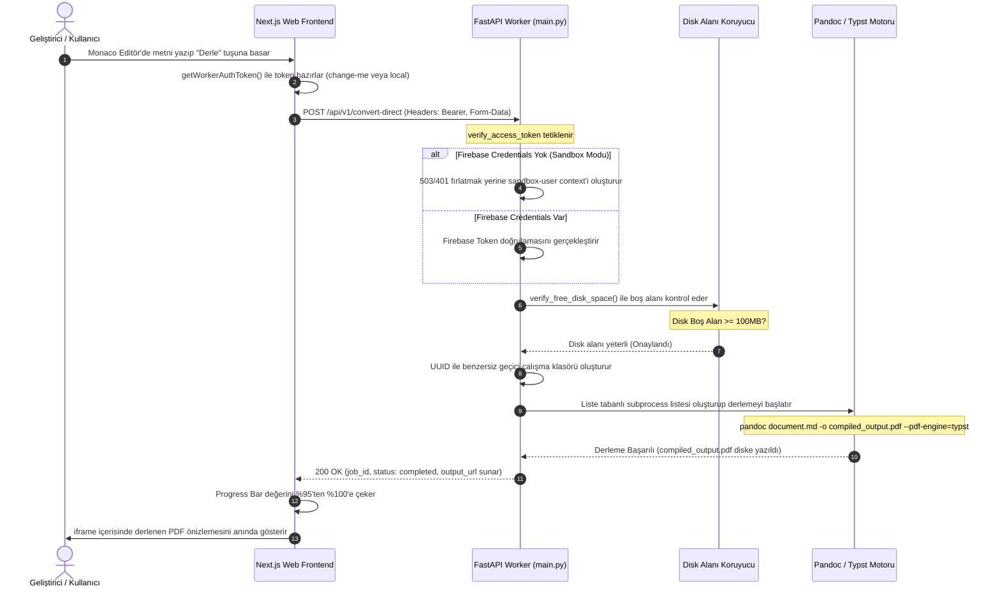

# 🏛️ Sistem Mimarisi ve Teknik Tasarım Dokümanı

Bu doküman, **Pandoc Orchestrator** platformunun Next.js (Frontend) ve Python FastAPI (Worker) mimarisi arasındaki ilişkiyi, Sandbox Modu altyapısını, API tasarım kararlarını, güvenlik limitlerini ve veri akış şemalarını detaylı olarak tanımlar.

---

## 1. Genel Sistem Mimari Yapısı

Sistem, istemci tarafındaki zengin düzenleyici bileşenleri ile sunucu tarafındaki izole dönüştürme motorunu birbirinden ayıran mikroservis odaklı bir monorepo yapısı üzerine kurulmuştur.

```text
                                  +---------------------------------------------+
                                  |            Next.js Web Uygulaması           |
                                  |  - Monaco Editör ve Zengin Arayüz           |
                                  |  - Aşamalı Derleme Progress Bar Kontrolü    |
                                  |  - Token & X-Request-ID Header Yönetimi     |
                                  +----------------------+----------------------+
                                                         |
                                                         | HTTP API POST / GET
                                                         v
                                  +---------------------------------------------+
                                  |            Python FastAPI Worker            |
                                  |  - Tracing & Audit Loglama Middleware'leri  |
                                  |  - Subprocess Liste Tabanlı CLI Derleyici   |
                                  |  - Disk Alanı Kontrolü & Motor Yönlendirici  |
                                  +----------------------+----------------------+
                                                         |
                         +-------------------------------+-------------------------------+
                         |                                                               |
                [ BULUT MODU ]                                                  [ SANDBOX MODU ]
  +---------------------------------------------+                +---------------------------------------------+
  |              Firebase Servisleri            |                |          Lokal Sandbox Çözümleri            |
  |  - Firestore: Kalıcı Loglar ve İş Akışları  |                |  - Bellek İçi SQLite/Dict Mock Veri Tabanı   |
  |  - Cloud Storage: Bulut Dosya Transferleri   |                |  - Lokal Disk Çıktı Sunucusu (/outputs)     |
  |  - Firebase SDK Token Kimlik Doğrulama      |                |  - Otomatik sandbox-user Rol Ataması         |
  +---------------------------------------------+                +---------------------------------------------+
```

---

## 2. Sıfır-Konfigürasyon Lokal Sandbox Modu (Zero-Config Local Sandbox Mode)

Platform, yerel geliştirici deneyimini en üst düzeye çıkarmak amacıyla, bulut bağımlılıkları olmadan tek tıkla çalışabilen akıllı bir **Sandbox Modu** içerir:

1. **Dinamik Kimlik Doğrulama Bypass Katmanı** (`verify_access_token`):
   Lokal çalışmada `firebase-service-account.json` dosyası bulunamadığında sistem otomatik olarak yerel sandbox durumuna geçer. Gelen isteklerde yer alan ve standart Firebase doğrulamalarından geçemeyen istemci token'ları engellenmek yerine otomatik olarak `{"uid": "sandbox-user", "provider": "sandbox"}` kullanıcı kimliği ile sisteme kabul edilir. Bu sayede 401 ve 503 yetkilendirme hataları tamamen engellenir.
2. **Bellek İçi Mock Veri Katmanı** (`FirebaseService`):
   Veritabanı işlemleri Firestore yerine bellek içi geçici sözlükler (`self._mock_logs` ve `self._mock_documents`) üzerinden taklit edilir.
3. **Statik Lokal Çıktı Sunucusu** (`/outputs/*`):
   Bulut depolama alanına erişilemediğinde derlenen tüm dokümanlar geçici olarak lokal disk üzerindeki `temp_workdir` dizininde saklanır ve FastAPI statik dosya sunucusu aracılığıyla `/outputs/{job_id}/{file_name}` adresi üzerinden anında indirilebilir ve önizlenebilir hale getirilir.

---

## 3. API Sürüm Yönetimi ve Yönlendirme (API Versioning & Routing)

Geriye dönük uyumluluğu korumak ve gelecekteki API genişletmelerine hazırlıklı olmak amacıyla, işçi (worker) servis mimarisindeki yönlendirme sistemi iki katmanlı olarak tasarlanmıştır:

- **Sürümlü Yönlendirme (`/api/v1`)**:
  Yeni geliştirilen ve tarayıcı istemcilerinin kullandığı tüm modern API uç noktaları `/api/v1` önekiyle (`APIRouter` aracılığıyla) tanımlanmıştır:
  - `GET /api/v1/health` - Sistem durum analizi ve kurulu dönüştürme motorlarının tespiti.
  - `POST /api/v1/convert-direct` - Firebase bağımlılığı olmadan doğrudan ham metin veya dosya dönüştürme.
  - `POST /api/v1/convert` - Asenkron kuyruk tabanlı bulut dönüştürme süreci.
  - `GET /api/v1/status/{job_id}` - Asenkron dönüştürme durumunun sorgulanması.
- **Kök Yönlendirme (`/`)**:
  Eski entegrasyonlar ve CLI betiklerinin kesintisiz çalışabilmesi amacıyla, tüm yönlendirmeler aynı zamanda kök `/` dizinine de yönlendirilir.

---

## 4. İstek İzleme ve JSON Log Altyapısı (Tracing & Structured Logging)

Hataların tespiti ve performans izlenebilirliği için işçi servisi içerisinde gelişmiş bir izleme mimarisi kurgulanmıştır:

- **İstek İzleme Middleware'i (`X-Request-ID`)**:
  İşçiye gelen her HTTP isteği için benzersiz bir `X-Request-ID` oluşturulur (istemci bu başlığı kendisi gönderirse korunur). Bu izleme numarası, asenkron Python `contextvars` modülü kullanılarak iş parçacığı ve eşzamanlı coroutine sınırlarından bağımsız olarak istek boyunca taşınır.
- **Yapılandırılmış JSON Log Biçimlendirici (`JsonFormatter`)**:
  Standart Python log sistemi tamamen devre dışı bırakılarak yerine JSON tabanlı yapılandırılmış çıktı üreten bir biçimlendirici eklenmiştir. Üretilen her satır log, isteğin taşımakta olduğu `request_id` bilgisini de içerir:
  ```json
  {
    "timestamp": "2026-05-26 01:50:50,020",
    "level": "INFO",
    "name": "app.main",
    "message": "Audit log: {\"event\": \"request_completed\", \"method\": \"POST\", \"path\": \"/api/v1/convert-direct\", \"status_code\": 200}",
    "request_id": "86563d5a-37c8-4187-bda9-25ea307e57e5"
  }
  ```
- **HTTP Denetim Günlüğü Middleware'i (HTTP Audit Logging)**:
  İstek başladığı andan itibaren geçen süreyi milisaniye hassasiyetinde ölçerek istek sonucunda istemci IP adresi, HTTP metodu, yol bilgisi, dönülen HTTP durumu ve işlem süresini log formatında çıktı verir.

---

## 5. Güvenli Subprocess CLI Komut Derleyicisi ve Limitler

Pandoc komutlarının sunucuda güvenli şekilde koşturulması için şu güvenlik ve kararlılık önlemleri uygulanmıştır:

1. **Komut Enjeksiyonu Koruması (No Shell Injection)**:
   FastAPI işçisi asla `shell=True` parametresiyle ham komut dizisi çalıştırmaz. Tüm argümanlar (`pandoc`, `document.md`, `--pdf-engine=typst` vb.) Python `subprocess.run` metoduna güvenli bir liste yapısında iletilir. Bu sayede girdi olarak gönderilen metinlerin arasına zararlı komutlar yerleştirilmesi tamamen engellenir.
2. **Lokal Disk Alanı Koruyucusu (Disk Guardian)**:
   Sistemin aşırı dosya yüklenmesinden dolayı çökmesini veya disk doluluğu nedeniyle yarıda kalmasını önlemek amacıyla, derleme işlemlerinden hemen önce Python `shutil.disk_usage` ile diskin durumu denetlenir. Eğer geçici çalışma dizinindeki boş alan `100MB` limitinin altındaysa derleme engellenir ve anında `507 Insufficient Storage` hatası fırlatılır.
3. **Bellek ve Süre Kısıtları (Resource Limits)**:
   Sonsuz döngülere giren veya çok büyük boyutlu girdiler içeren derlemeleri kesmek için her derleme komutuna maksimum `120 saniye` süre limiti atanmıştır. Süre aşımında işlem otomatik olarak iptal edilir ve kullanıcıya açıklayıcı bir derleme hatası dönülür.

---

## 6. PDF ve Slayt Motoru Akıllı Yönlendirme Algoritması

FastAPI işçisi, sistemde kurulu olan PDF/Slayt derleme yazılımlarını dinamik olarak tarar. Dönüştürme sırasında seçilen motorun bulunamaması durumunda aşağıdaki akıllı yönlendirme sırasını takip eder:

- **PDF Derleme Sırası**:
  İstekle gelen tercih (`preferred`) ➔ `xelatex` ➔ `typst` ➔ `weasyprint` ➔ `pdflatex` ➔ `lualatex` ➔ `tectonic` ➔ **HTML Fallback (PDF motoru hiç yoksa uyarı vererek çıktı formatını otomatik HTML'e düşürür)**.
- **Slayt Derleme Sırası**:
  İstekle gelen tercih ➔ `revealjs` ➔ `pptx` ➔ `beamer` ➔ `slidy`.

---

## 7. Next.js İstemci Durum Makinesi ve Canlı Önizleme Entegrasyonu

Önizleme paneli (`apps/web/src/components/preview.tsx`), derleme durumlarını gerçek zamanlı ve kullanıcı dostu bir şekilde görselleştiren gelişmiş bir durum makinesine sahiptir:

- **Dinamik Aşamalı Yükleme Barı (Progress State Machine)**:
  Derleme başladığında yükleme barı anında `%5` değerine ayarlanır. Ardından her `250ms` aralıkla asenkron olarak ilerleme oranını artırır. İlerleme hızı algoritmik olarak belirlenir: ilk aşamalarda hızlı ilerleme sağlanırken (`%50`'ye kadar adım başı `%8`), orta aşamalarda yavaşlar (`%75`'e kadar `%4`), son aşamaya yaklaştıkça daha da azalarak `%95` sınırında duraklar. Derleme tamamlandığı anda progress bar anında `%100` değerine yükselerek derleme önizlemesini ekrana getirir.
- **Akıllı Çift Katmanlı Önizleme Kararı**:
  Eğer derlenen dosya PDF veya HTML ise, tarayıcı içinde yer alan güvenli `iframe` katmanında doküman anında görselleştirilir. Eğer çıktı formatı tarayıcı tarafından doğrudan gösterilemeyen bir format ise (örneğin `.docx` veya `.pptx`), sistem kullanıcıyı yormamak adına sayfa üzerinde harika bir **Masaüstü/Premium Önizleme Şablonu (Visual Simulation Canvas)** sunarak dokümanın yapısını, başlıklarını ve matematiksel formüllerini şık bir biçimde taklit eder.

---

## 8. Kritik Derleme Veri Akış Şeması (Sequence Flow)

Aşağıdaki diyagramda, lokal Sandbox Modu kapsamında Monaco editöründen gönderilen bir Markdown metninin Typst motoru aracılığıyla PDF'e dönüştürülme süreci gösterilmiştir:



---

**Pandoc Orchestrator, üst düzey güvenlik, sıfır-konfigürasyon geliştirici dostu altyapı ve kusursuz önizleme teknolojileri ile tasarlanmıştır.**